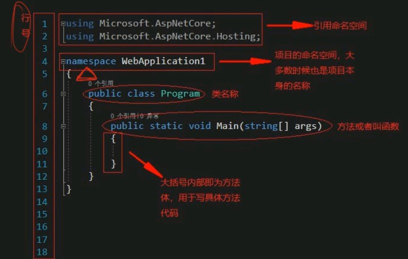
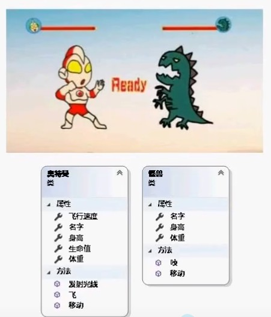

# CShape基础

## 一、C#语言及其特点

- C#是微软公司发布的一种面向对象的、运行于.NET Framework和.NET Core（完全开源，跨平台）之上的高级程序设计语言

- C#是一种安全的、稳定的、简单的、优雅的，由C和C++衍生出来的面向对象的编程语言。它在继承C和C++强大功能的同时去掉了一些它们的复杂特性

- C#是**面向对象**的编程语言


## 二、认识.NET Framework和.NET Core

### .NET是什么


### .NET和C#的关系,这是初学者最常见的问题


## 三、Visual Studio 2019的安装与使用

### 简介

Mirosoft Visual Studio(简称VS)是美国微软公司的开发工具包系列产品。VS是一个基本完整的开发工具集。是编写C#程序或者说.NET程序最常用的开发工具。因其功能强大、简单易用、速度快、智能度高。被网友戏称宇宙第一IDE

1. 下载地址：https://visualstudio.microsoft.com/zh-hans/free-developer-offers/

2. VS安装，此时需要联网

3. 根据自己的情况选择需要的安装模块，一般选择“ASP.NET开发”、“.NET桌面开发”、“通用Windows平台开发”、“数据库存储和处理”、“Visual Studio扩展开发”、“.NET Core跨平台开发”

4. 点击安装即可开始创建第一个项目

## 四、C#语法基础

### cs文件结构


结构展示



1. 程序的第一行`using System;` `using`关键字用于在程序中包含`System`命名空间。一个程序一般有多个`using`语句

2. 下一行是`namespace`声明。一个`namespace`是一系列的类。 `WebApplication1` 命名空间包含了类`Program`。

3. 下一行是`class`声明。类`Program`包含了程序使用的数据和方法声明。类-般包含多个方法。 方法定义了类的行为。在这里，`Program`类只有一 个`Main`方法。

4. 下一行定义了`Main`方法，是所有C#程序的入口点。`Main`方法说明当执行时类将做什么动作。

5. Main方法通过方法体中的语句指定它的行为。

 

### C#基本语法

**注意:**

- C#大小写敏感的。

- 所有的语句和表达式必须以分号`;`结尾。

- 与Java不同的是，文件名可以不同于类的名称。

C#是一种面向对象的编程语言。在面向对象的程序设计方法中，程序由各种对象组成。相同种类的对象通常具有相同的类型。

> 案例:
> 以人类为例，从人类中诞生出的具体对象“C罗”和“梅西”，同属人类，故俩人类型相同。

### 关键字

关键字，是对编译器有**特殊意义**的**预定义保留标示符**，它们**不能**在程序中用作标示符

- using关键字

  在任何C#程序中的第一条语句都是: `using System;`

  `using`关键字用于在程序中包含命名空间。一个程序可以包含多个`using`语句。

- class关键字

  class关键字用于声明一个类。

- C#的注释方式

  1. // 单行注释
  2. /**/ 多行注释
  3. /// 文档注释（注释于类或方法等地方，其他地方调用的时候会提示对应注释）
  4. 注释的作用:

    - 解释:说明代码作用

    - 注销:将暂时不需要的代码注销

>铭记:
>
>1. 不写注释是流氓
>2. 名字瞎起是扯淡
>3. 相比注销，注释意义更大
>4. 要做到别人一看就能看懂

#### 变量

- 变量是一个供程序存储数据盒子。在C#中，每个变量都有一个特定的类型，不同类型的变量其内存大 小也不尽相同。

- C# 中提供的基本类型大致分为以下几类：

  | 类型       | 举例                   |
  | ---------- | ---------------------- |
  | 整数类型   | byte、short、int、long |
  | 浮点型     | float、double          |
  | 十进制类型 | decimal                |
  | 布尔类型   | bool                   |
  | 字符类型   | string、char           |
  | 空类型     | null                   |

  

## 五、C#语法进阶

### 表达式

- 表达式由**操作数(operand)**和**运算符(operator)**构成。运算符的示例包括`+`、`-`、`\*`、`/`和`new`。操作数的示例包括文本、字段、局部变量和表达式。

- 当表达式包含多个运算符时，运算符的优先级(precedence)控制各运算符的计算顺序。例如，表达式`x + y * z`按`x + (y * z)`计算，因为`*`运算符的优先级高于`+`运算符。 

- (了解)大多数运算符都可以**重载(overload)**。运算符重载允许指定用户定义的运算符实现来执行运算，这 些运算的操作数中至少有一个，甚至所有操作数都属于用户定义的类类型或结构类型。

- 下表总结了C#简单常用的运算符，并按优先级从高到低的顺序列出各运算符类别。同类别中的运算符 优先级相同。

| **类别**       | **表达式**       | **说明**                                          |
| -------------- | ---------------- | ------------------------------------------------- |
| 基本           | `x.m`            | 成员访问                                          |
|                | `x(...)`         | 方法和委托调用                                    |
|                | `x[...]`         | 数组和索引器访问                                  |
|                | `newT(...)`      | 对象和委托创建                                    |
|                | `newT(...){...}` | 使用初始值设定项创建对象                          |
|                | `new{...}`       | 匿名对象初始值设定项                              |
|                | `newT[...]`      | 数组创建                                          |
| 一元           | `+x`             | 恒等                                              |
|                | `-x`             | 求相反数                                          |
|                | `!x`             | 逻辑求反                                          |
|                | `~x`             | 按位求反                                          |
|                | `++x`            | 前增量                                            |
|                | `--x`            | 前减量                                            |
|                | `x++`            | 后增量                                            |
|                | `x--`            | 后减量                                            |
|                | `(T)x`           | 将x显示转换为类型T                                |
| 二元           | `x * y`          | 乘法                                              |
|                | `x / y`          | 除法                                              |
|                | `x % y`          | 取余                                              |
|                | `x + y`          | 加法，字符串串联                                  |
|                | `x - y`          | 减法                                              |
|                | `x << y`         | 位左移                                            |
|                | `x >> y`         | 位右移                                            |
|                | `x < y`          | 小于                                              |
|                | `x > y`          | 大于                                              |
|                | `x <= y`         | 小于或等于                                        |
|                | `x >= y`         | 大于或等于                                        |
|                | `x  is T`        | 如果 x 位 T ，返回`true`，否则`false`             |
|                | `x  as T`        | 返回转换为类型 T 的 x ,如果 x 不是 T 则返回`null` |
|                | `x == y`         | 等于                                              |
|                | `x != y`         | 不等于                                            |
|                | `x & y`          | 整形按位与  ,布尔逻辑AND                          |
|                | `x | y`          | 整形按位或  ,布尔逻辑OR                           |
|                | `x && y`         | 且，当 x 为`true`时，才对 y 求值                  |
|                | `x || y`         | 或，当 x 为`false`时。才对 y 求值                 |
|                | `x ?? y`         | 如果 x 为`null`，则计算结果为 y，否则为 x         |
| 三元           | `x ? y : z`      | 如果 x 为`true`,对 y 求值，x 为`false`，对 z 求值 |
| 赋值或匿名函数 | `x = y`          | 赋值                                              |
|                | `x = x + y`      | 复合赋值                                          |
|                | `(T x) => y`     | 匿名函数（lambda表达式）                          |

 

### 分支语句

#### if 语句

```c#
//如果i>1则执行{}里面的代码
if(i > 1){
    
}
```


#### if-else 语句

```c#
//if(如果)i > 1则执行后面{}的代码，else(否则)执行else后面{}的代码
if(i > 1){
    ...
}
else{
    ...
}
//////////////////////
//if(如果)i >= 10则执行后面{}的代码，else if(否则 如果)i > 0 && i < 10则执行这后面{}的代码，还不满足条件的话则执行else后面{}的代码
if(i >= 10){
    ...
}
else if(i > 0 && i < 10 ){
    ...
}
else{
    
}


```


#### switch 语句

```c#
//给定一个变量switch识别是哪个则执行对应的case，否则执行default（未找到对应变量的case）
switch(i){
    case 1:
        
		break;
    case 2:
        
		break;
    case 3:
        
		break;
    default:
        
		break;
}
```


#### 循环语句

##### for循环

```C#
//for(参数一；参数二；参数三)
//参数一：设定个初始变量
//参数二：给定条件，条件满足设定的变量的时候执行循环
//参数三：初始变量自增
for(int i = 0; i<10;i++ )
{
    ...
}
```

##### while循环

```C#
//如果（）里面为true真，则进入循环，到}后跳转到while头部再判断（）里面的是否为true，true则继续循环，否则直接到跳出循环
while(true){
	...
}
```

##### do-while循环

```C#
//直接进入循环，到}后如果while（）里面的值为true真，则继续跳转到do{开头开始循环循环，否则直接到跳出循环执行后面的代码
do{
    ...
}while(true);
```

### 数组

- 数组是一组相同类型的数据。

- 数组中的数据需要通过数字索引来访问。

#### 数组的声明 

- 数组的声明需要使用`new`关键字。

- 在声明数组时，可以使用`{}`来初始化数组中的元素。

- 如果在数组声明之初没有使用大括号来初始化数组中的元素，则需要指定数组的大小。

- 在声明初始化有元素的数组时，也可以指定数组大小。

```C#
//声明没有元素的数组     
int[] ints = new int[6];
//声明初始化有元素的数组     
int[] ints = new int[]{1, 3, 4, 5};
//在声明初始化有元素的数组时，也可以指定数组大小     
string[] strings = new strings[5]{"H"， “E"， "L"，“L","0"};
//在声明初始化有元素的数组时，指定数组大小可以直接={值1，值2}   
string[] strs = {"张三”， "李四”，“王五”，”赵六”，"田七”，”周八”};
```

#### 通过索引获取数组中的元素。  

- 给数组指定长度时，数组准备存放多少元素，长度就设置为多少。
- 用索引获取数组内的元素时，索弓|从0开始获取。
- 所以数组中最大的索引数字，比指定数组长度小1。

```C#
//声明初始化有元素的数组  
int[] ints = new int[]{1, 3，4，5}  
//获取数组中第1个的元素。
int i1 = ints[0];  
//给数组内的元素赋值
ints[0]  = 1  
```

#### 总结提升

##### 案例一：老公买西瓜系列。

- 超市西瓜的价格是1.9元/斤。

- 老公下班买了6斤西瓜。

- 此时得知正逢双11,购买商品满10元优惠7.5折。

- 问此时老公买西瓜花了多少钱?

###### 思考

- 以上案例需要设置几个变量?

- 需要声明何种类型的变量?

- 如果体重要求满几个10元， 就在几个10元上打7.5折应该如何计算?

###### 总结

- **变量名***只有在**某一区域内**第1次出现时才要声明变量。

- 变量名在区域内第二次出现时不用声明变量，而是直接使用之前声明的变量。

- 变量名命名是我们一般遵循驼峰命名法，即以小写宇母开头，多个单词拼接时，除第一个单词外， 其余首字母大写。

- 在程序开发中可以修改之前保存的变量值。

###### 扩展

- `(int)`表示使用显式强制转换，是一种类型转换，C#默认整型是int32, 因此使用此方法转成int 32位，不遵循四舍五入，只截取整数部分;

- `(int)5.21  //输出5`

- `Int.Parse()`: 只支持将`string`类型转成`int`, `Parse`就是把`String`类型转换成`int`,`char`,`double`...等,也就是`*.Parse(string)`括号中的一定要是`string`类型。

```C#
String st="5.21";
double n=5.21;
Int . Parse(st);//输出5
Int .Parse(n);//报错
```

- `Convert.Tolnt32(double value)` ,不完全遵循四舍五入，如果value为两个整数中间的数字，则返回二者中的偶数，

对比下面的例子:

```C#
Console.WriteLine(Convert.ToInt32(4.3));//四舍五入，输出4
Console.WriteLine(Convert.ToInt32(4.5));//第一位小数为5时，4. 5在4和5之间，输出偶数4 
Console.WriteLine(Convert.ToInt32(4.53)); //四舍五入，输出5
Console.WriteLine(Convert.ToInt32(5.3));//四舍五入，输出5
Console.WriteLine(Convert.ToInt32(5.5)); //第一位小数为5时，5.5在5和6之间，输出偶数6 
Console.WriteLine(Convert.ToInt32(5.53)); //四舍五入，输出6
```

> 注意：`ConvertToInt32()`和`int.Parse()`对于空值（`null`）的处理不同，`ConvertToInt32(null)`会返回0而不会产生任何异常，但`int.Parse(null)`则会产生异常。

##### 案例二：班级找赵六系列

- 班级中有张三、李四、王五、赵六、田七、周八共六位同学。

- 请找出赵六同学送他回家。

- 分别是用for循环和while循环实现。

###### 思考

- 以上案例需要设置几个变量?

- 需要声明何种类型的变量?

- for循环和while循环实现上有何差异?

- 用do-while循环如何实现。

###### 总结

- 对于数组的初始化还有一种简便的方式: `string[] strs = {"张三”， "李四”，“王五”，”赵六”，"田七”，”周八”}`。

- 获取数组长度的方式:`strs .Length` 。

- 需要跳出某个循环时可以使用`break` 关键字，跳出当前循环。

- 满足某些条件后需要直接快进到下一轮循环而不再执行当前循环下的代码，可以使用`continue` 关键字实现。

### 函数初识

- 函数好比是对象的动作行为。

- 在定义函数要想好函数所承担的作用，职责(作用) 越单一越好。

#### 函数的命名规范

- 函数命名使用**大驼峰命名**，即**开头首字母大写**

- 多个单词拼接时，所有单词首字母大写。

```C#
Add();
AddCount();
GetUsrInfo();
```

#### 函数的参数设置&传参行为

- 参数可认为是外部需要函数帮忙处理的数据。

- 外部通过传递参数的形式，将需要处理的数据交给函数处理。

#### 函数返回值的设置

- 函数返回值可以认为是外部调用某种行为后得到的一种反馈。

#### 拓展-- 参数修饰符

修饰符种类

1. 无修饰符:如果一个参数没有用参数修饰符标记，则认为它将**按值进行传递**，这将意味着被调用的方法收到原始数据的**一份副本**。

2. `out`: 输出参数**由被调用的方法赋值**，因此**按引用传递**，如果被调用的方法没有给输出参数赋值，就会出现编译错误，也就是说，只要调用了，就必须给赋值。`out` 最大的用途就是调用者只使用一次方法的调用就能获得多个返回值。（在C#7.0中要实现一次方法的调用就能获得多个返回值，建议使用元组。**是元组不是元祖**），调用的是指针，是地址

3. `ref`: **调用者赋初值**，并且可以由被调用的方法可选的**重新赋值**（数据是按引用传递的）。如果被调用的方法未能给`ref`参数赋值，也不会有编译器错误。

4. 了解即可`params`：这个参数修饰符允许将一组可变的数量的参数作为单独的逻辑参数进行传递， 方法只能有一个`params`修饰符，而且必须是方法的最后一个参数。

5. `out`和`ref`的区别
   - `out`修饰的参数必须在方法内修改，而`ref`可以修改也可以不修改;

   - `out`在传入参数的时候，参数是局部变量的话，可以不用赋值，因为`out`一定会对其进行赋值;

   - 而`ref`修饰的参数，在实参必须有初始值才能调用。因为`ref`修饰的不一定会给它赋值。

## 六、面向对象(OOP)基本概念

面向对象编程---`Object Oriented Programming` 简写 `OOP`

### 目标

- 了解面向对象基本概念

### 01.面向对象基本概念

- 之前所接触到的编程方式叫做**面向过程**

- 面向过程和面向对象是两种不同的编程方式

- 对比面向过程的特点，可以更好的了解什么是面向对象

#### 1.1 过程和函数(科普)

- 过程是早期的一个编程概念

- 过程类似于函数，只能执行，但是没有返回值

- 函数不仅能执行，还可以返回结果

#### 1.2 面向过程和面向对象基本概念

##### 1.2.1 面向过程---怎么做?

	1. 把完成某一个需求的所有步骤从头到尾 逐步实现
	
	2. 根据开发需求，将某些功能独泣的代码封装成一个又一个函数
	
	3. 最后完成的代码，就是顺序的调用不同的函数

###### 面向过程的特点

1. 注重步骤与过程，不注重职责分工

2. 如果需求复杂，代码会变得很复杂

3. 复杂项目，没有固定的套路，难度很大!

  


##### 1.2.2 面向对象---谁来做

> 相比较函数， 面向对象是更大的封裝，根据职责，在一个对象中封裝多个方法

1. 在完成某一个需求前，首先确定职责，要做的事情（方法）

2. 根据职责确定不同的对象，在对象内部封装不同的方法（多个）

3. 最后完成代码，就是顺序的让不同的对象调用不同的方法、

###### 面向对象的特点

1. 注重对象和职责，不同的对象承担不同的职责

2. 更加适合应对复杂的需求变化，题门应对复杂项目开发，提供固定套路

3. 要在面向过程基础上，学习些面向对象的语法



## 七、类和对象

### 目标

- 类和对象的概念

- 类和对象的关系

- 类的设计

### 01.类和对象的概念

**类**和**对象**是面向对象编程的两个核心概念

#### 1.1 类

- 类是对一群具有相同特征或者行为的事物的一个统称，是抽象的，不能直接使用

  - **特征**被称为**属性**

  - **行为**被称为**方法**

- 类就相当于制汽车是的图纸，是-一个模板，是负责创建对象的


#### 1.2 对象

- 对象是由类创造出来的一个具体存在，可以直接使用

- 由哪一个类创造出来的对象，就拥有在哪一个类中定义的属性和方法

- 对象就相当于用图纸制造的汽车

在程序开发中，应先有类，再有对象

  |

### 02.类和对象的关系

- **类**是模板，**对象**是根据**类**这个模板创建出来的，应该先有类，再有对象

- 类只有一个， 而对象可以有很多个

  - 不同的对象之间属性的具体内容可能各不相同

- **类中定义了什么属性和方法，对象中就有什么属性和方法，不可能多，也不可能少**

### 03.类的设计

在使用面向对象开发前，应该首先分析需求，确定一下程序中需要包含哪些类


在程序开发中要设计一个类，通常需要满足以下三个要素:

1. **类名**这类事物的名称，满足大驼峰命名法

2. **属性**这类事物具有什么样的特征

3. **方法**这类事物具有什么样的行为

#### 3.1 类名的确定

名词提炼法分析整个业务流程，出现的名词，通常就是找到的类。

#### 3.2 属性和方法的确定

- 对对象的特征，描述通常可以定义成属性。

- 对象具有的行为通常可以定义为方法。注：方法般是动作即动词

> 提示：需求没有涉及的属性或者方法在设计类时，不需要考虑

#### 练习1

##### 需求

- 张三今年18岁，身高1米75，每天早上跑完步回去吃东西

- 李四今年17岁，身高1米65，他不跑步，但喜欢吃东西

| 类名 | **人**           |
| ---- | ---------------- |
| 属性 | 名字，年龄，身高 |
| 方法 | 跑步(), 吃()     |

#### 练习2 

##### 需求

- 一只灰色的怪兽叫哥斯拉

- 他会喷火烧

- 还会发射激光

| 类名 | **怪兽**           |
| ---- | ------------------ |
| 属性 | 名字，颜色         |
| 方法 | 喷火(), 发射激光() |

### 04.类和对象的使用

#### 4.1 声明类

- 声明一个类需要使用`class`关键字
- 类的属性及方法写在`{}`中
- 后面不加分号

```C#
public class Person{

}
```

#### 4.2 声明属性

- 属性在C#中较为独特，他既不同于方法，也不同于字段。

- 属性依旧遵循大驼峰命名法

- 属性最常用的书写方法: `public int Age {get; set;}`

- 如果属性中具有`get`关键字，说明可以获取该属性的值。

- 如果属性中具有`set`关键字，说明可以向该属性设置值。

#### 4.3 声明方法

*详见函数初识*

#### 4.4 实例化

- 类使用关键字`new`实例化对象。

- 一个类可以实例化多个对象。

- 对象可以使用类定义的属性和方法。

#### 4.5 知识拓展

##### 访问修饰符

###### 访问修饰符:

- `public`: 公有的，所有的类都可以访问

- `private`: 私有的，当前类内部可访问。

- `protected`: 受保护的，当前类以及继承他的子类可访问

- `internal`:内部的，只限于本项目内访问，其他的不能访问。

- `protected internal`:内部保护访问，只能是本项目内部或子类访问，其他类不能访问

###### 访问级别约束:

- 父类子类访问修饰符要保持一 致

- 方法的访问修饰符要和方法参数的访问修饰符保持一致

> 注意: 类的访问级别默认为隐式私有需要加上`public` 才可让外部访问

静态方法、 属性

- 静态和属性方法通过`static` 关键字修饰

- 静态和属性可以通过类型直接获取，非静态则必须通过实例化的对象获取

静态类

- 静态类通过`static` 关键字修饰

- 一般情况下类型不需要使用静态修饰，只有当类型中存在扩展方法时需要使用静态类

## 十、集合&字典的初识

### 01.集合的使用

- 集合与数组比较类似，都用于存放**一组值**。

#### 1.1 数组的优劣分析

##### 优势

- 数组在内存中是**连续存储**的，所以它的索引速度是非常的快，而且赋值与修改元素也很简单。

##### 劣势

- 在数组的两个数据间插入数据很麻烦。

- 在声明数组的时候， 必须同时**指明数组的长度**，数组的长度过长，会造成内存浪费，数组和长度过短，会造成数据溢出的错误。

#### 1.2  `ArrayList`的使用

- `ArrayList`是.NET Framework提供的用于数据存储和检索的专用类
- 它是命名空间`System.Collections`下的一部分

##### `ArrayList`的优势

- `ArrayList` 的大小是按照其中存储的数据来动态扩充与收缩的
- 在声明`ArrayList`对象时并不需要指定它的长度
- `ArrayList`可以很方便的进行数据的添加，插入和移除

```C#
ArrayList arrayList=new ArrayList();
arrayList.Add(123);		//将数据新增到集合结尾处
arrayList.Add("abc");	//将数据新增到集合结尾处
arrayList[2]=345;     	//修改指定索引的数据
arrayList.RemoveAT(0);  //移除指定索引处的数据
arrayList.Remove(123);  //移除内容为123的数据
arrayList.Insert(0,"hello world");    //再指定索引处插入数据
```

> 从上面示例看，`ArrayList`好像是解决了数组中所有的缺点，那么它应该就是完美的。可是在C#2.0后又会出现了`List`集合，这是为何?

##### `ArrayList`的劣势

- `ArrayList`在存储数据时是使用`object`类型进行存储的
- `ArrayList`不是类型安全的，使用时很可能会出现类型不匹配的错误
- 就算都有插入了同一类型的数据，但在使用的时候，我们也需要将它们转化为对应的原类型来处理
- `ArrayList`的存储存在**装箱和拆箱**操作，导致其性能低下

#### 1.3 装箱与拆箱的概念

- **装箱**就是将比如`int`类型或者`string`等不同的对象通过**隐式转换**赋给`object`对象。

```C#
int i = 123;
object o= 1;  
```

- **拆箱**就是将`object`对象通过**显示转换**赋给`int`类型的变量

```C#
object o=123;
int i = (int)o;  
```

- 装箱与拆箱的过程会产生较多的 性能损耗。
- 正是因为`ArrayList`存在不安全类型与装箱拆箱的缺点，所以在C#2.0后出现了**泛型**的概念。
- 泛型的概念在此先不多做表述，为便于大家记忆，可以简单理解成：限制集合只能够存储**单一类型数据**的一种手段。

#### 1.4  `List`集合

- 目前我们只需要学习List集合这一 种类型即可，以此为突破口，以后再学习其他集合就会非常容易

##### List集台的声明

- `List` 集合与`ArrayList` 由于都继承成了相同的接口，故使用与`ArrayList` 相似。

- 在声明`List`集合时，需要同时为其声明`List`集合内数据的**对象类型**

- 示例: `List<int> intList = new List();`

所谓**接口**目前可以简单理解成**限制和规定类型行为**即**类型方法**的一种手段

```C#
List<int> list = new List<int>();   // 第一种初始化方式
list.Add(123);      // 新增数据到结尾处
List<int>  intList = new List<int>  // 第二种初始化方式
{
    123,
    456,
    789
};
intList[2] = 345;
intList.RemoveAt(0);    // 删除指定索引处的数据
intList.Remove(123);    // 删除内容为123的数据
intList.Insert(0, 6688);
```

上例中如果我们往List集合中插入string宇符"hello world",系统就会报错，且不能通过编译。这样就避免了前面讲的类型安全问题与装箱拆箱的性能问题

##### 思考

- 在上一节“类的使用"中我们知道，`int`本身也是一 个类型，`in`t类型声明的变量接受`int`类型的数据， `int`类型可以指定`List`集合的数据类型。那么我们自己创建的类型是否可以限定`List`集合的数据类型呢?
  - 答案是：可以。

##### 总结

- 集合与数组比较类似，都用于存放一组值

- 集合中提供了特定的方法能直接操作集合中的数据，并提供了不同的集合类来实现特定的功能

- 简单的说就是数组的升级版。他可以动态的对集合的长度(也就是集合内最大元素的个数)进行定义和维护

- `List`泛型的好处指通过允许指定**泛型类或方法**操作的**特定类型**，减少了类型强制转换的需要和运行时错误的可能性，泛型提供了类型安全，但没有增加开销。

### 02. `Dictionary`字典的使用

- 在声明`Dictionary`字典时，需要同事为其声明`Dictionary`字典内的键与值的类型

- 示例：`Dictionary<int, string> dictionary = new Dictionary<int, string>();`

键与值可以是任何类型，但是键必须在设置时是唯一的，而值可以不唯一，就好比每个学生的学号必须是唯一的，而所有的成绩可以不唯一。

```C#
Dictionary<int, string> dictionary = new Dictionary<int,  string>();
//两种赋值方式  
// 方  式 一 ：Add 方 法 赋 值 
dictionary.Add(1, "98分"); 
dictionary.Add(2, "92分");  
dictionary.Add(3, "89分"); 
dictionary.Add(1, "88分");	//系统会报错  
//方式二：索引器赋值  
dictionary[1] = "88分";		//系统不会报错
dictionary[4]  = "99分";  
//方式三：对象初始化器  
Dictionary<string, string> dictionary2 = new  Dictionary<string, string>()  {
	{"A","aa" },  
	{"B","BB" },  
	{"C","CC" }  
};  
```

注意`dictionary[1]`方式既可以赋新值可以修改原来已键有的值，类似于数组索引器的使用, 所以可以使用之前已使用过的键。但是`Add`方法不可以添加已有键的值。

```C#
//获取键为1的值  
//方式一：索引器取值  
string value = dictionary[1];  
//方式二：foreach遍历取值  
foreach (KeyValuePair<string, string> item in dictionary) {  
    int key  = item.Key; 
	string value = item.Value;  
}  
//移除键为1的键值对
dictionary.Remove(1);
```

#### 总结

- **键**与**值**可以是任何类型，但是键必须在设置时是唯一 的，而值可以不唯一

- 使用`Add()`方法添加键值对，不可添加已有的键名

- 索引模式可以**新赋值**也可以**修改已有的键值**。


### 03. `foreach`的使用

- `foreach`就是传说中的增强`for`循环或者称作`foreach`循环

- `foreach`对遍历字典或集合具备天然优势，效率高过`for`循环

#### 3.1 `foreach`操作数组

```c#
int[] ints= {1，2，3，4，5，6};
foreach (int item in ints){  //每次循环，其item都是整型数组中的一个元素  } 
```

#### 3.2 `foreach`操作集合

```C#
List<int> intList = new  List<int>() { 1, 2，3, 4，5, 6 }; 
foreach (int item in ints){  //每次循环，其item都是List集合中的一个元素  }
```

#### 3.3 `foreach`操作字典

```C#
Dictionary<string, string> dictionary = new Dictionary<string,  string>() {  
    { "A","aa"}, 
    { "B","bb"}, 
    { "C","cc"}，
};  
foreach  (KeyValuePair<int, string> item  in dictionary) {
    int key  = item.Key; 
	string value =  item.Value; 
}  
```

